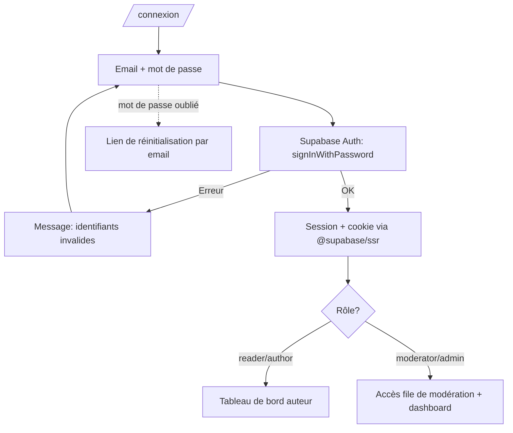
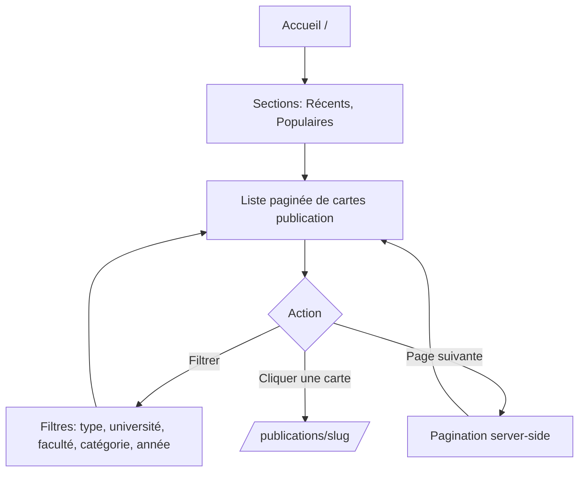
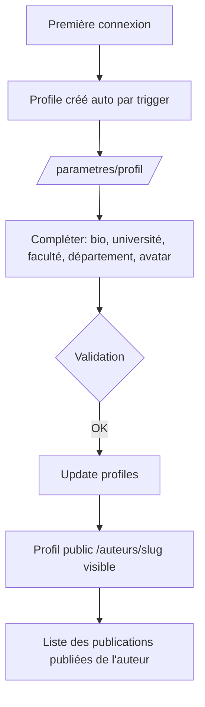
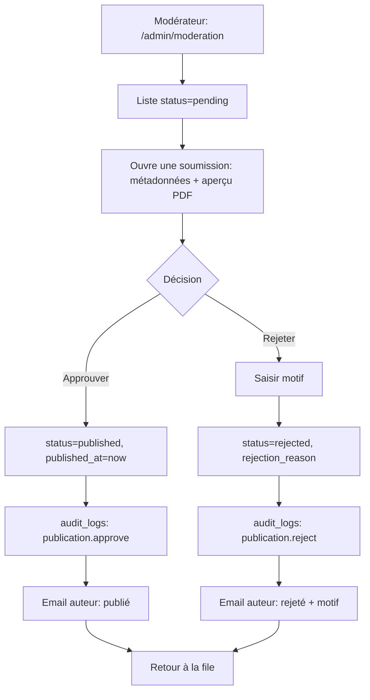

# 06 — User Flows

Mermaid diagrams for the core journeys. Render in any Mermaid-aware viewer (GitHub, VS Code).

---

## 1. Sign Up

```mermaid
flowchart TD
    A[Visiteur ouvre /inscription] --> B[Saisit nom, email, mot de passe]
    B --> C{Validation form (zod)}
    C -- Invalide --> B
    C -- Valide --> D[Supabase Auth: signUp]
    D --> E{Email confirmation activée?}
    E -- Oui --> F[Email de confirmation envoyé]
    F --> G[Utilisateur clique le lien]
    G --> H[Trigger handle_new_user crée profile]
    E -- Non --> H
    H --> I[Session active]
    I --> J[Redirection vers tableau de bord]
```

## 2. Login



## 3. Upload Publication

```mermaid
flowchart TD
    A[Auteur: /publier] --> B{Connecté?}
    B -- Non --> L[Redirection /connexion] --> A
    B -- Oui --> C[Formulaire: PDF + métadonnées]
    C --> D[Choix fichier PDF]
    D --> E{Type PDF & taille <= 25MB?}
    E -- Non --> F[Erreur format/taille] --> D
    E -- Oui --> G[Saisie titre, résumé, type, université,
        faculté, département, année, langue, catégorie, mots-clés, co-auteurs]
    G --> H[Coche attestation: travail/droits]
    H --> I{Action}
    I -- Enregistrer brouillon --> J[status=draft, upload PDF -> bucket]
    I -- Soumettre --> K[Upload PDF + insert publication status=pending]
    K --> M[Insert publication_files, keywords, authors]
    M --> N[Email: soumission reçue]
    N --> O[Écran: en attente de modération]
    J --> P[Liste 'Mes publications' (brouillon)]
```

## 4. Browse Publications



## 5. Search Publications

```mermaid
flowchart TD
    A[Barre de recherche] --> B[Saisie requête]
    B --> C[plainto_tsquery('french', unaccent(q))]
    C --> D[SELECT publications WHERE status=published
        AND search_vector @@ query ORDER BY ts_rank]
    D --> E{Résultats?}
    E -- 0 --> F[État vide + suggestions/filtres]
    E -- >0 --> G[Liste classée par pertinence]
    G --> H[Affiner via filtres] --> D
    G --> I[Cliquer -> page détail]
```

## 6. Download Publication

```mermaid
flowchart TD
    A[Page détail publication] --> B[Clic 'Télécharger']
    B --> C[Route handler /api/telecharger/:id]
    C --> D{status = published?}
    D -- Non --> E[403]
    D -- Oui --> F[RPC increment_download(id, ip_hash)]
    F --> G[Créer signed URL (bucket privé, expiration courte)]
    G --> H[Redirection/stream du PDF vers l'utilisateur]
```

## 7. Save Publication

```mermaid
flowchart TD
    A[Page détail / carte] --> B[Clic 'Enregistrer']
    B --> C{Connecté?}
    C -- Non --> D[Inviter à se connecter] --> E[/connexion/]
    C -- Oui --> F[Insert saved_publications (user_id, publication_id)]
    F --> G[Bouton bascule -> 'Enregistré']
    G -. re-clic .-> H[Delete saved_publications] --> A
```

## 8. Author Profile Creation



## 9. Publication Moderation



## 10. Admin Management

```mermaid
flowchart TD
    A[Admin: /admin] --> B[Dashboard: compteurs + activité récente]
    B --> C{Tâche}
    C -- Modération --> D[File de modération (flow 9)]
    C -- Signalements --> E[Liste reports status=open]
    E --> F{Action sur report}
    F -- Légitime --> G[Masquer/supprimer publication + actioned]
    F -- Infondé --> H[dismissed]
    G --> I[audit_logs]
    H --> I
    C -- Utilisateurs --> J[Changer rôle (author/moderator)]
    J --> I
    C -- Référentiels --> K[Gérer universités/facultés/catégories]
    K --> I
```
